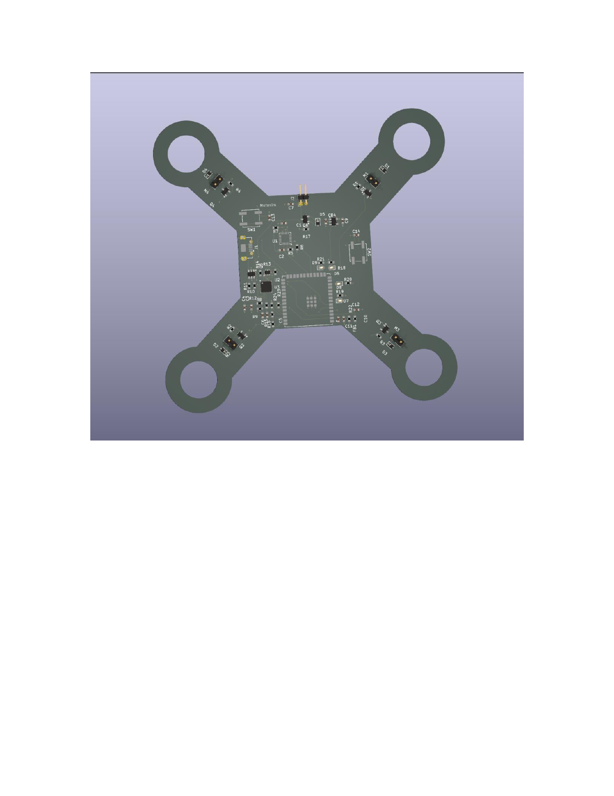
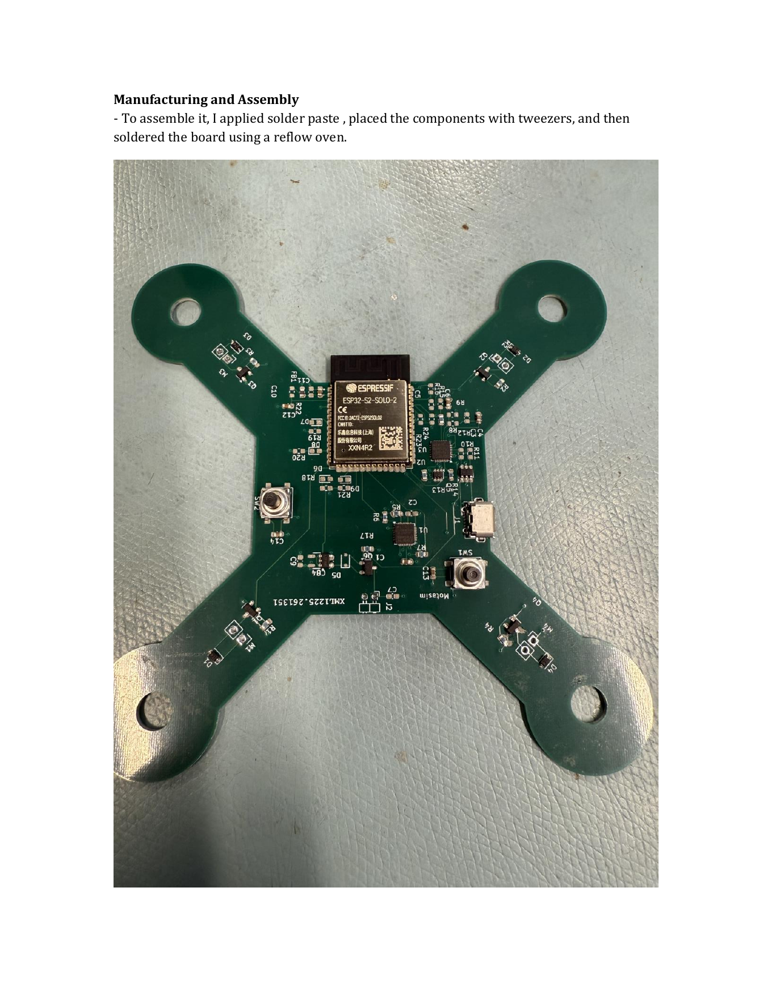
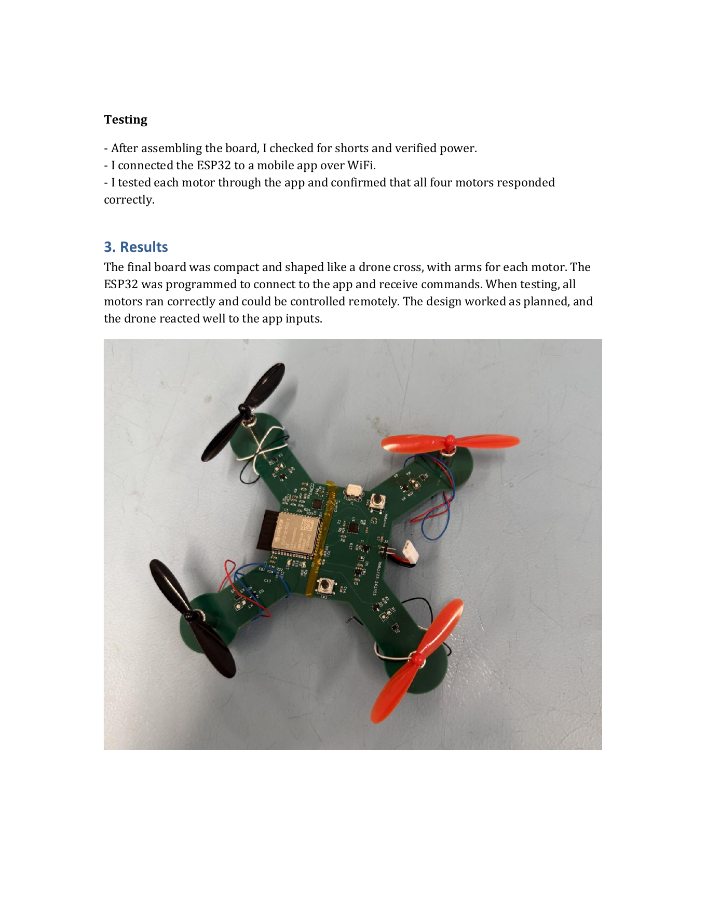

# WiFi-Controlled Quadcopter PCB Using ESP32

Custom PCB design for a WiFi-controlled quadcopter based on the ESP32 microcontroller. The board was designed in KiCad, assembled using solder paste and a reflow oven, and tested with four motor outputs controlled through a mobile app.

## Project overview

The goal of this project was to design a compact quadcopter control PCB that integrates the main electronics on a single board and reduces external wiring.

## Key features

- ESP32-based control board with built-in WiFi capability
- Custom quadcopter-shaped PCB designed in KiCad
- Four motor-control outputs using MOSFET driver stages
- USB interface for programming/debugging
- SMD assembly using solder paste and reflow oven
- Power verification and short-circuit testing after assembly
- Functional motor testing using mobile-app WiFi control

## Hardware design

The KiCad project is located in:

```text
hardware/kicad/
```

Included schematic sheets:

```text
my_drone.kicad_sch
mcu.kicad_sch
motor.kicad_sch
power.kicad_sch
usb.kicad_sch
imu.kicad_sch
```

The PCB layout file is:

```text
my_drone.kicad_pcb
```

## Figures

### KiCad 3D view



### Assembled PCB



### Motor test setup



## Tools and technologies

- KiCad
- ESP32
- PCB design
- SMD soldering
- Reflow soldering
- MOSFET motor switching
- WiFi-based control
- Hardware testing and troubleshooting

## Firmware note

The original motor-control setup was tested using an existing mobile-control framework. This repository focuses on the custom PCB hardware design, assembly and validation. 
## Repository structure

```text
wifi-controlled-quadcopter-pcb/
├── README.md
├── .gitignore
├── hardware/
│   └── kicad/
├── figures/